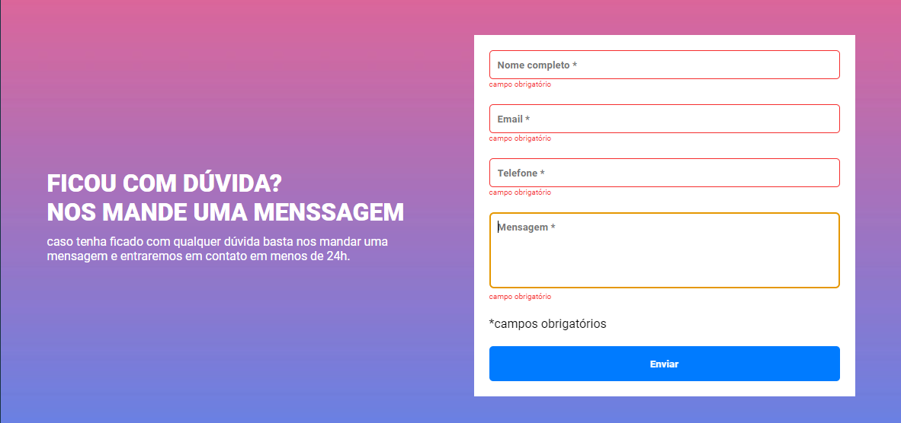

# Formulário com validação

#### Projeto  
* Validação do formulário feita com
javascript puro. 

* Caso algum campo não estiver preenchido, a borda do input fica vermelha e uma mensagem de "campo obrigatório" aparece embaixo do campo que não foi preenchido.

* A borda do input ficará verde caso as informações sejam válidas.

#### Ferramentas Utilizadas  
* HTML  
* CSS  
* JavaScript  

#### Layout  

#### Invalidado  

#### Validado  
